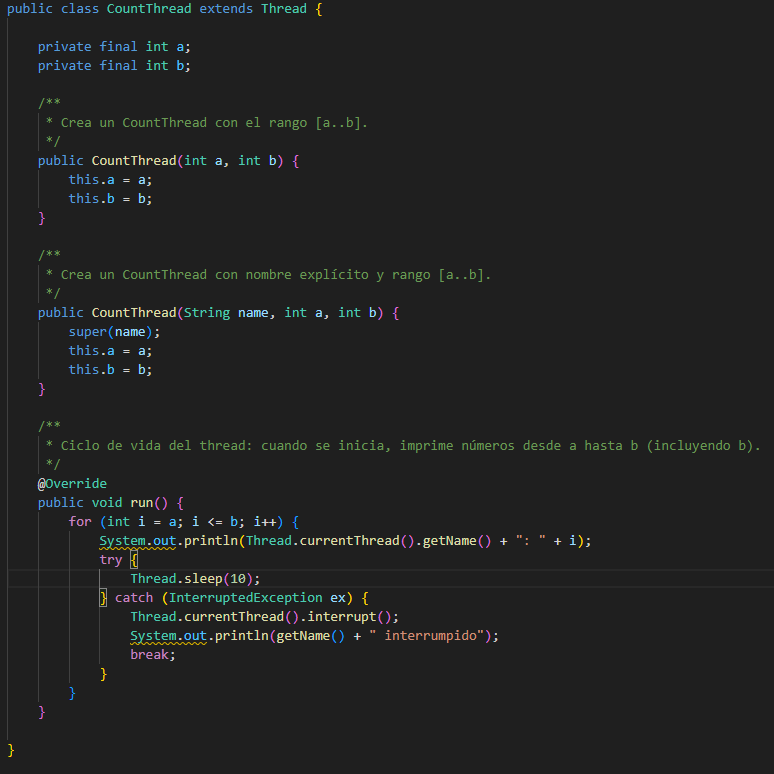
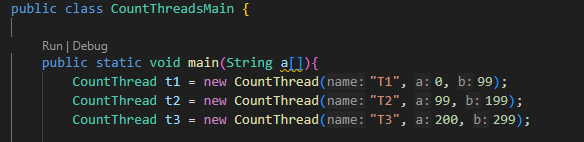
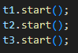
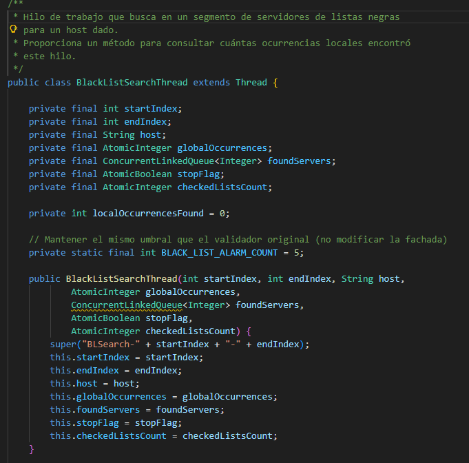
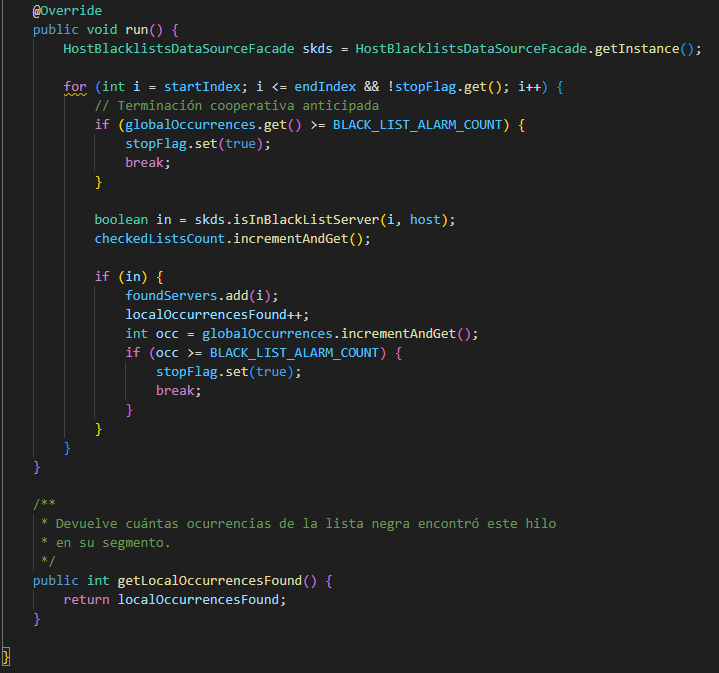
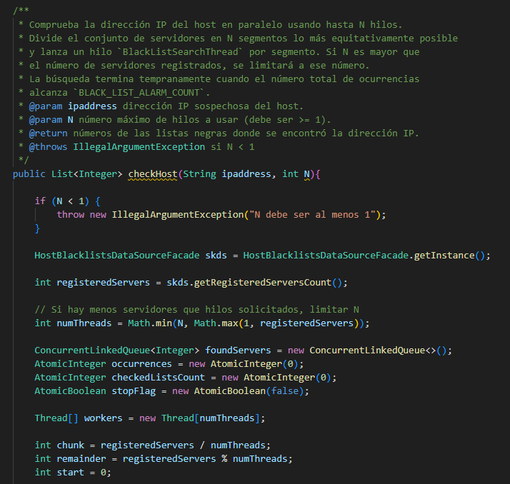
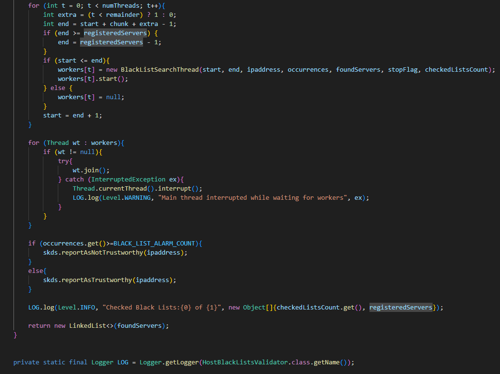

### Escuela Colombiana de Ingeniería
### Arquitecturas de Software - ARSW
## Ejercicio Introducción al paralelismo - Hilos - Caso BlackListSearch

## Parte 1 - Introducción a Hilos en Java

1.

2.
Creación de Intervalos

Inicio de hilos con start().

Salida por pantalla con start().

	T1: 0
	T3: 200
	T2: 99
	T1: 1
	T3: 201
	T2: 100
	T2: 101
	T3: 202
	T1: 2
	T2: 102
	T3: 203
	T1: 3
	T2: 103
	T3: 204
	T1: 4
	T2: 104
	T1: 5
	T3: 205
	T1: 6
	T2: 105
	T3: 206
	T2: 106
	T3: 207
	T1: 7
	T1: 8
	T2: 107
	T3: 208
	T3: 209
	T2: 108
	T1: 9
	T2: 109
	T3: 210
	T1: 10
	T1: 11
	T3: 211
	T2: 110
	T2: 111
	T3: 212
	T1: 12
	T2: 112
	T1: 13
	T3: 213
	T1: 14
	T3: 214
	T2: 113
	T2: 114
	T3: 215
	T1: 15
	T2: 115
	T1: 16
	T3: 216
	T2: 116
	T3: 217
	T1: 17
	T2: 117
	T1: 18
	T3: 218
	T2: 118
	T1: 19
	T3: 219
	T3: 220
	T2: 119
	T1: 20
	T1: 21
	T2: 120
	T3: 221
	T1: 22
	T3: 222
	T2: 121
	T1: 23
	T2: 122
	T3: 223
	T2: 123
	T1: 24
	T3: 224
	T2: 124
	T1: 25
	T3: 225
	T2: 125
	T3: 226
	T1: 26
	T1: 27
	T3: 227
	T2: 126
	T2: 127
	T3: 228
	T1: 28
	T3: 229
	T2: 128
	T1: 29
	T2: 129
	T1: 30
	T3: 230
	T2: 130
	T3: 231
	T1: 31
	T1: 32
	T3: 232
	T2: 131
	T3: 233
	T1: 33
	T2: 132
	T3: 234
	T2: 133
	T1: 34
	T2: 134
	T1: 35
	T3: 235
	T2: 135
	T1: 36
	T3: 236
	T3: 237
	T2: 136
	T1: 37
	T2: 137
	T1: 38
	T3: 238
	T1: 39
	T3: 239
	T2: 138
	T1: 40
	T3: 240
	T2: 139
	T3: 241
	T1: 41
	T2: 140
	T3: 242
	T1: 42
	T2: 141
	T3: 243
	T1: 43
	T2: 142
	T2: 143
	T3: 244
	T1: 44
	T2: 144
	T1: 45
	T3: 245
	T2: 145
	T1: 46
	T3: 246
	T3: 247
	T1: 47
	T2: 146
	T1: 48
	T3: 248
	T2: 147
	T3: 249
	T2: 148
	T1: 49
	T3: 250
	T1: 50
	T2: 149
	T2: 150
	T3: 251
	T1: 51
	T2: 151
	T3: 252
	T1: 52
	T2: 152
	T3: 253
	T1: 53
	T3: 254
	T2: 153
	T1: 54
	T2: 154
	T1: 55
	T3: 255
	T1: 56
	T3: 256
	T2: 155
	T1: 57
	T3: 257
	T2: 156
	T2: 157
	T3: 258
	T1: 58
	T3: 259
	T2: 158
	T1: 59
	T2: 159
	T1: 60
	T3: 260
	T2: 160
	T1: 61
	T3: 261
	T2: 161
	T3: 262
	T1: 62
	T2: 162
	T1: 63
	T3: 263
	T1: 64
	T2: 163
	T3: 264
	T1: 65
	T2: 164
	T3: 265
	T2: 165
	T3: 266
	T1: 66
	T1: 67
	T2: 166
	T3: 267
	T3: 268
	T2: 167
	T1: 68
	T1: 69
	T2: 168
	T3: 269
	T2: 169
	T3: 270
	T1: 70
	T2: 170
	T3: 271
	T1: 71
	T1: 72
	T2: 171
	T3: 272
	T1: 73
	T3: 273
	T2: 172
	T1: 74
	T2: 173
	T3: 274
	T3: 275
	T1: 75
	T2: 174
	T2: 175
	T3: 276
	T1: 76
	T2: 176
	T3: 277
	T1: 77
	T3: 278
	T1: 78
	T2: 177
	T3: 279
	T2: 178
	T1: 79
	T3: 280
	T1: 80
	T2: 179
	T3: 281
	T2: 180
	T1: 81
	T3: 282
	T2: 181
	T1: 82
	T3: 283
	T1: 83
	T2: 182
	T3: 284
	T2: 183
	T1: 84
	T1: 85
	T2: 184
	T3: 285
	T1: 86
	T3: 286
	T2: 185
	T2: 186
	T3: 287
	T1: 87
	T1: 88
	T2: 187
	T3: 288
	T3: 289
	T1: 89
	T2: 188
	T2: 189
	T1: 90
	T3: 290
	T3: 291
	T2: 190
	T1: 91
	T2: 191
	T1: 92
	T3: 292
	T1: 93
	T3: 293
	T2: 192
	T1: 94
	T2: 193
	T3: 294
	T3: 295
	T1: 95
	T2: 194
	T2: 195
	T3: 296
	T1: 96
	T3: 297
	T1: 97
	T2: 196
	T1: 98
	T2: 197
	T3: 298
	T1: 99
	T2: 198
	T3: 299
	T2: 199
	El conteo de hilos ha terminado.

Salida por pantalla con run()

	main: 0
	main: 1
	main: 2
	main: 3
	main: 4
	main: 5
	main: 6
	main: 7
	main: 8
	main: 9
	main: 10
	main: 11
	main: 12
	main: 13
	main: 14
	main: 15
	main: 16
	main: 17
	main: 18
	main: 19
	main: 20
	main: 21
	main: 22
	main: 23
	main: 24
	main: 25
	main: 26
	main: 27
	main: 28
	main: 29
	main: 30
	main: 31
	main: 32
	main: 33
	main: 34
	main: 35
	main: 36
	main: 37
	main: 38
	main: 39
	main: 40
	main: 41
	main: 42
	main: 43
	main: 44
	main: 45
	main: 46
	main: 47
	main: 48
	main: 49
	main: 50
	main: 51
	main: 52
	main: 53
	main: 54
	main: 55
	main: 56
	main: 57
	main: 58
	main: 59
	main: 60
	main: 61
	main: 62
	main: 63
	main: 64
	main: 65
	main: 66
	main: 67
	main: 68
	main: 69
	main: 70
	main: 71
	main: 72
	main: 73
	main: 74
	main: 75
	main: 76
	main: 77
	main: 78
	main: 79
	main: 80
	main: 81
	main: 82
	main: 83
	main: 84
	main: 85
	main: 86
	main: 87
	main: 88
	main: 89
	main: 90
	main: 91
	main: 92
	main: 93
	main: 94
	main: 95
	main: 96
	main: 97
	main: 98
	main: 99
	main: 99
	main: 100
	main: 101
	main: 102
	main: 103
	main: 104
	main: 105
	main: 106
	main: 107
	main: 108
	main: 109
	main: 110
	main: 111
	main: 112
	main: 113
	main: 114
	main: 115
	main: 116
	main: 117
	main: 118
	main: 119
	main: 120
	main: 121
	main: 122
	main: 123
	main: 124
	main: 125
	main: 126
	main: 127
	main: 128
	main: 129
	main: 130
	main: 131
	main: 132
	main: 133
	main: 134
	main: 135
	main: 136
	main: 137
	main: 138
	main: 139
	main: 140
	main: 141
	main: 142
	main: 143
	main: 144
	main: 145
	main: 146
	main: 147
	main: 148
	main: 149
	main: 150
	main: 151
	main: 152
	main: 153
	main: 154
	main: 155
	main: 156
	main: 157
	main: 158
	main: 159
	main: 160
	main: 161
	main: 162
	main: 163
	main: 164
	main: 165
	main: 166
	main: 167
	main: 168
	main: 169
	main: 170
	main: 171
	main: 172
	main: 173
	main: 174
	main: 175
	main: 176
	main: 177
	main: 178
	main: 179
	main: 180
	main: 181
	main: 182
	main: 183
	main: 184
	main: 185
	main: 186
	main: 187
	main: 188
	main: 189
	main: 190
	main: 191
	main: 192
	main: 193
	main: 194
	main: 195
	main: 196
	main: 197
	main: 198
	main: 199
	main: 200
	main: 201
	main: 202
	main: 203
	main: 204
	main: 205
	main: 206
	main: 207
	main: 208
	main: 209
	main: 210
	main: 211
	main: 212
	main: 213
	main: 214
	main: 215
	main: 216
	main: 217
	main: 218
	main: 219
	main: 220
	main: 221
	main: 222
	main: 223
	main: 224
	main: 225
	main: 226
	main: 227
	main: 228
	main: 229
	main: 230
	main: 231
	main: 232
	main: 233
	main: 234
	main: 235
	main: 236
	main: 237
	main: 238
	main: 239
	main: 240
	main: 241
	main: 242
	main: 243
	main: 244
	main: 245
	main: 246
	main: 247
	main: 248
	main: 249
	main: 250
	main: 251
	main: 252
	main: 253
	main: 254
	main: 255
	main: 256
	main: 257
	main: 258
	main: 259
	main: 260
	main: 261
	main: 262
	main: 263
	main: 264
	main: 265
	main: 266
	main: 267
	main: 268
	main: 269
	main: 270
	main: 271
	main: 272
	main: 273
	main: 274
	main: 275
	main: 276
	main: 277
	main: 278
	main: 279
	main: 280
	main: 281
	main: 282
	main: 283
	main: 284
	main: 285
	main: 286
	main: 287
	main: 288
	main: 289
	main: 290
	main: 291
	main: 292
	main: 293
	main: 294
	main: 295
	main: 296
	main: 297
	main: 298
	main: 299
	El conteo de hilos ha terminado.

¿Que cambia si uso start o run?

- Con start() se crean hilos nuevos y la salida es concurrente e intercalada, cada linea aparece con el nombre del hilo (T1,T2,T3)

- Con run() no se crean hilos nuevos, todo se ejecuta en el hilo actual (en este caso main) secuencialmente. La salida se imprimirá en bloque, pues salen primero todos los numeros de [0..99], luego de [99..199], y por ultimo los de [199..299]. Además las líneas estarán prefijadas por el nombre del hilo actual, porque Thread.currentThread().getName devuelve main.

## Parte 2 - Ejercicio Black List Search

1. Implementé una clase llamada BlackListSearchThread que se encarga de buscar en una porción de las listas negras. Cada hilo lleva su propio contador de coincidencias y tiene un método para consultar ese número; cuando entre todos alcanzan 5 coincidencias se detienen para ahorrar tiempo. La lógica usa una cola compartida para reunir los índices encontrados y no modifiqué la clase que hace las consultas (la fachada).

Pruebas de la clase: 

2. Con respecto a la clase HostBlackListValidator implementé el método checkHost para que cree varios hilos, cada hilo busca en su rango y guarda los índices donde encontró la IP en una cola compartida; además hay un contador compartido de coincidencias y una bandera que indica que deben detenerse cuando se alcanzan 5 detecciones, los hilos se inician y se espera a que terminen (join), luego se reporta la IP como no confiable o confiable según el contador, se registra en el log cuántas listas se consultaron y se devuelve la lista de servidores donde fue encontrada la IP.

Dividí la búsqueda en N hilos: cada hilo revisa su tramo, guarda dónde encuentra la IP y contamos todas las coincidencias; esperamos a que terminen (join), sumamos los resultados y si hay ≥5 la marcamos como no confiable y mostramos las listas donde apareció. Dejé una sobrecarga sin N que llama a la nueva y el LOG informa cuántas listas se consultaron.

Al momento de Ejecutar Main, comprobé que efectivamente, la dirección IP 200.24.34.55 no es confiable, porque se encontro en 5 listas.

	ene 23, 2026 2:20:30 PM edu.eci.arsw.spamkeywordsdatasource.HostBlacklistsDataSourceFacade reportAsNotTrustworthy
	INFORMACIËN: HOST 200.24.34.55 Reported as NOT trustworthy
	ene 23, 2026 2:20:30 PM edu.eci.arsw.blacklistvalidator.HostBlackListsValidator checkHost
	INFORMACIËN: Checked Black Lists:8.007 of 80.000
	The host was found in the following blacklists:[23, 50, 200, 500, 1000]

La dirección IP 202.24.34.55 si es confiable, pues no aparece en ninguna lista

	ene 23, 2026 2:33:41 PM edu.eci.arsw.spamkeywordsdatasource.HostBlacklistsDataSourceFacade reportAsTrustworthy
	INFORMACIËN: HOST 212.24.24.55 Reported as trustworthy
	ene 23, 2026 2:33:41 PM edu.eci.arsw.blacklistvalidator.HostBlackListsValidator checkHost
	INFORMACIËN: Checked Black Lists:80.000 of 80.000
	IP probada: 212.24.24.55 -> Listas encontradas: []

La dirección IP 202.24.34.55 no es confiable, pues aparece en listas muy distribuidas, pero aparece en 5 de ellas, por lo tanto, no es segura.

	ene 23, 2026 2:33:26 PM edu.eci.arsw.spamkeywordsdatasource.HostBlacklistsDataSourceFacade reportAsNotTrustworthy
	INFORMACIËN: HOST 202.24.34.55 Reported as NOT trustworthy
	ene 23, 2026 2:33:26 PM edu.eci.arsw.blacklistvalidator.HostBlackListsValidator checkHost
	INFORMACIËN: Checked Black Lists:8.012 of 80.000
	IP probada: 202.24.34.55 -> Listas encontradas: [29, 10034, 20200, 70500, 31000]

